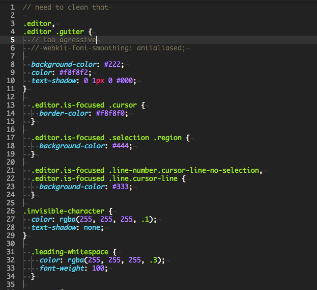

# Monokai Tweaked Syntax theme

> Monokai Tweaked Syntax theme for Atom.

This theme Monokai Tweaked Syntax theme can be installed and activated by going to the Themes section in the Settings view (cmd-,) and selecting it from the Syntax Themes dropdown menu.

